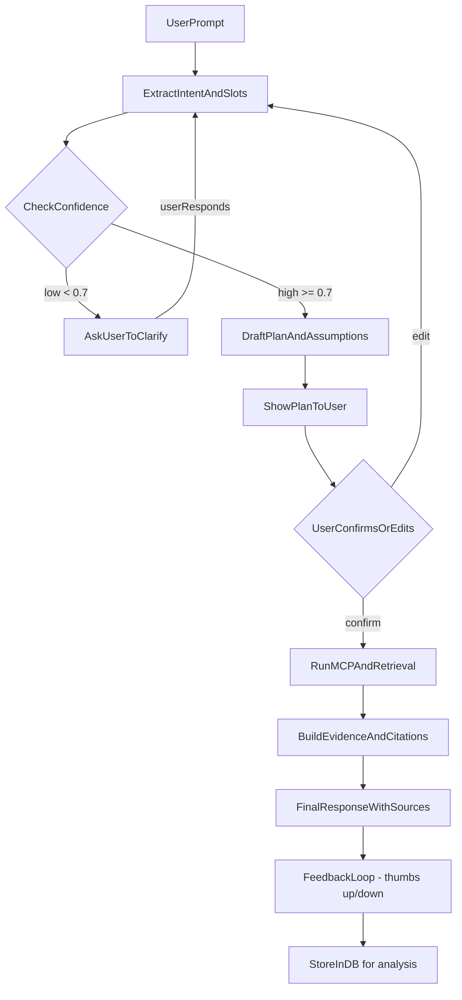

# Specyfikacja Projektu: Impact Chad

## Spis treści

1. [Przegląd projektu](#1-przegląd-projektu)
2. [Pełny zakres funkcjonalny (docelowy)](#2-pełny-zakres-funkcjonalny-docelowy)
   - 2.1 [Integracje](#21-integracje)
   - 2.2 [Funkcje dodatkowe](#22-funkcje-dodatkowe)
3. [Ograniczony zakres PoC](#3-ograniczony-zakres-poc)
   - 3.1 [Co jest włączone](#31-co-jest-włączone)
   - 3.2 [Co jest wyłączone](#32-co-jest-wyłączone)
   - 3.3 [Ograniczenia PoC](#33-ograniczenia-poc)
4. [Architektura techniczna](#4-architektura-techniczna)
   - 4.1 [Stack technologiczny](#41-stack-technologiczny)
   - 4.2 [Struktura projektu](#42-struktura-projektu)
   - 4.3 [Przepływ danych](#43-przepływ-danych)
   - 4.4 [Zarządzanie dużym kontekstem](#44-zarządzanie-dużym-kontekstem-token-limits-chunking-rag--wymagane-w-produkcji)
   - 4.5 [Tryb Plan-first (Ask-before-Act)](#45-tryb-plan-first-ask-before-act)
   - 4.6 [Kontrakt wejścia dla typów zapytań](#46-kontrakt-wejścia-dla-typów-zapytań)
   - 4.7 [Evidence Policy (polityka dowodów)](#47-evidence-policy-polityka-dowodów)
   - 4.8 [Krytyczne fallbacki](#48-krytyczne-fallbacki-ochrona-przed-halucynacjami-i-nadgorliwością)
   - 4.9 [Wskazówka praktyczna (PoC vs produkcja)](#49-wskazówka-praktyczna-poc-vs-produkcja)
5. [Zabezpieczenia Monday.com](#5-zabezpieczenia-mondaycom)
   - 5.1 [Trzy warstwy ochrony](#51-trzy-warstwy-ochrony)
   - 5.2 [Szczegóły implementacji](#52-szczegóły-implementacji)
6. [Konfiguracja i uruchomienie](#6-konfiguracja-i-uruchomienie)
   - 6.1 [Wymagane zmienne środowiskowe](#61-wymagane-zmienne-środowiskowe)
   - 6.2 [Instalacja zależności](#62-instalacja-zależności)
   - 6.3 [Uruchomienie PoC](#63-uruchomienie-poc)
   - 6.4 [Migracje bazy danych](#64-migracje-bazy-danych-tylko-dla-pełnej-wersji)
7. [Instrukcja konfiguracji Monday.com](#7-instrukcja-konfiguracji-mondaycom)
   - 7.1 [Uzyskanie API Token](#71-uzyskanie-api-token)
   - 7.2 [Ograniczenie do boardu](#72-ograniczenie-do-boardu)
   - 7.3 [Bezpieczeństwo tokenu](#73-bezpieczeństwo-tokenu)
8. [Przejście z PoC do pełnej wersji](#8-przejście-z-poc-do-pełnej-wersji)
   - 8.1 [Krok 1: Przywrócenie PostgreSQL](#81-krok-1-przywrócenie-postgresql)
   - 8.2 [Krok 2: Przywrócenie Google OAuth](#82-krok-2-przywrócenie-google-oauth)
   - 8.3 [Krok 3: Włączenie Slack](#83-krok-3-włączenie-slack)
9. [Rozwiązywanie problemów](#9-rozwiązywanie-problemów)
   - 9.1 [Monday.com MCP nie łączy się](#91-mondaycom-mcp-nie-łączy-się)
   - 9.2 [Gemini AI nie odpowiada](#92-gemini-ai-nie-odpowiada)
   - 9.3 [Błędy związane z bazą danych](#93-błędy-związane-z-bazą-danych)
10. [Strategia Kosztowa & Wybór Modelu AI](#10-strategia-kosztowa--wybór-modelu-ai)
    - 10.1 [Porównanie Kosztów](#101-porównanie-kosztów-grudzień-2024)
    - 10.2 [Rekomendowana Strategia](#102-rekomendowana-strategia-oszczędna)
    - 10.3 [Optymalizacja Kosztów](#103-optymalizacja-kosztów)
    - 10.4 [Rate Limits](#104-rate-limits-anthropic---grudzień-2024)
    - 10.5 [Provider Abstraction Layer](#105-provider-abstraction-layer)
11. [Dokumentacja dodatkowa](#11-dokumentacja-dodatkowa)
12. [Implementation Plan (Phases)](#12-implementation-plan-phases)
    - 12.1 [Workflow faz](#121-workflow-faz)
    - 12.2 [Przegląd faz](#122-przegląd-faz)
    - 12.3 [Szczegóły faz](#123-szczegóły-faz)
    - 12.4 [Backlog techniczny](#124-backlog-techniczny)
    - 12.5 [Otwarte punkty](#125-otwarte-punkty-do-doprecyzowania-w-backlogu)

## 1. Przegląd projektu

Chatbot oparty na Next.js wykorzystujący Google Gemini AI do interakcji z użytkownikami oraz integrację z Monday.com przez Model Context Protocol (MCP) do odczytu danych z tablic projektowych.

## 2. Pełny zakres funkcjonalny (docelowy)

### 2.1 Integracje

#### AI Provider Strategy (Anthropic lub Google)
- **Status aktualny**: Anthropic Claude (grudzień 2024)
- **Strategia**: Single provider (ALBO Anthropic ALBO Google, nie oba jednocześnie)
- **Przełączanie**: Przez zmienną środowiskową `AI_PROVIDER`

##### Opcja A: Anthropic Claude (obecna)
- **Model domyślny**: `claude-haiku-4-5` ($1/$5 per MTok) - **REKOMENDOWANE dla oszczędności**
- **Model fallback**: `claude-haiku-3` ($0.25/$1.25 per MTok) - ultra-tani dla prostych zapytań
- **Model premium**: `claude-sonnet-4-5` ($3/$15 per MTok) - dla złożonych zadań
- **Funkcjonalność**: 
  - Doskonałe tool calling (Monday, Slack)
  - Świetny coding support (73.3% SWE-bench dla Haiku 4.5)
  - 200K context window
  - Streaming odpowiedzi
  - Constitutional AI (wbudowane safety guardrails)

##### Opcja B: Google Gemini (przyszłość - potencjalna migracja)
- **Model**: `gemini-2.0-flash` ($0.075/$0.30 per MTok) - **97% taniej niż Sonnet!**
- **Zalety**: 
  - Ultra-długi context (1M tokens)
  - Bardzo niski koszt
  - Native Polish support
  - Native tool calling
- **Wady**:
  - Słabszy reasoning niż Claude Sonnet
  - Mniej testowany w enterprise
  
**Decyzja**: Obecnie Anthropic ze względu na jakość reasoning i tool calling. Gemini jako opcja migracji w przyszłości jeśli koszty będą problem.

#### Monday.com (MCP)
- **Tryb**: Read-only (tylko odczyt)
- **Zabezpieczenia**:
  - Flaga `-ro` na poziomie MCP servera
  - Whitelist/blacklist narzędzi
  - Ograniczenie do wybranego board ID
- **Dostępne operacje**:
  - Przeglądanie tablic (boards)
  - Przeglądanie zadań (items)
  - Przeglądanie kolumn i grup
  - Wyszukiwanie danych

#### Slack
- **Funkcjonalność**:
  - Przeszukiwanie historii kanałów
  - Pobieranie wiadomości z kanałów
  - Integracja z historią rozmów zespołu

#### Autoryzacja (Google OAuth)
- **Status**: ✅ **Już zbudowane w kodzie** (wyłączone w PoC)
- **Mechanizm**: NextAuth.js z Google Provider
- **Funkcjonalność**:
  - Logowanie przez Google
  - Opcjonalne ograniczenie do domeny Google Workspace
  - Sesje użytkowników
- **Przywrócenie**: Zobacz sekcję 8.2 - wymaga tylko konfiguracji Google Cloud Console i zmiennych środowiskowych

#### Baza danych (PostgreSQL)
- **Funkcjonalność**:
  - Przechowywanie użytkowników
  - Historia czatów
  - Persystencja danych między sesjami

### 2.2 Funkcje dodatkowe

- **Pogoda**: Narzędzie do pobierania aktualnej pogody
- **Historia czatów**: Zapisywanie i przeglądanie poprzednich rozmów
- **Tematy**: Obsługa dark/light mode
- **Multimodal input**: Obsługa załączników w wiadomościach

## 3. Ograniczony zakres PoC

### 3.1 Co jest włączone

- ✅ **Gemini AI** - pełna funkcjonalność
- ✅ **Monday.com MCP** - read-only, ograniczony do board ID `5088645756` (konto testowe)
- ✅ **Pogoda** - narzędzie getWeather
- ✅ **Podstawowy UI** - interfejs czatu

### 3.2 Co jest wyłączone

- ❌ **Google OAuth** - brak autoryzacji (dostęp otwarty)
- ❌ **PostgreSQL** - brak persystencji (historia tylko w sesji przeglądarki)
- ❌ **Slack** - integracja wyłączona
- ❌ **Zapisywanie historii** - brak zapisu do bazy danych

### 3.3 Ograniczenia PoC

- Historia czatów dostępna tylko w bieżącej sesji przeglądarki
- Brak autoryzacji - każdy może używać aplikacji
- Monday.com ograniczony do jednego boardu (ID: `5088645756` - konto testowe)
- Brak możliwości zarządzania użytkownikami

## 4. Architektura techniczna

### 4.1 Stack technologiczny

- **Framework**: Next.js 15 (App Router)
- **AI SDK**: Vercel AI SDK v3.4.9
- **AI Provider**: Anthropic Claude (obecnie) / Google Gemini (opcja przyszłościowa)
  - **@ai-sdk/anthropic**: v1.2.12
  - **@ai-sdk/google**: v0.0.51 (gotowe do użycia)
- **Model AI aktualny**: Claude Haiku 4.5 (default) / Haiku 3 (fallback) / Sonnet 4.5 (premium)
- **MCP**: @modelcontextprotocol/sdk v1.24.3
- **Styling**: Tailwind CSS + shadcn/ui
- **TypeScript**: v5

**Uwaga**: Nazwa projektu "Impact Chad" jest historyczna - obecnie używamy Anthropic Claude ze względu na lepszą jakość reasoning i tool calling. Gemini pozostaje jako opcja migracji w przyszłości.

### 4.2 Struktura projektu

```
impact-chad/
├── app/
│   ├── (auth)/          # Strony autoryzacji (wyłączone w PoC)
│   └── (chat)/          # Główna aplikacja czatu
│       ├── api/chat/    # API endpoint dla czatu
│       └── page.tsx      # Strona główna
├── components/
│   ├── custom/          # Komponenty aplikacji
│   └── ui/              # Komponenty UI (shadcn)
├── integrations/
│   └── mcp/             # Integracja Monday.com MCP
├── db/                  # Schemat i zapytania DB (zmockowane w PoC)
├── ai/                  # Konfiguracja modeli AI
└── docs/                # Dokumentacja
```

### 4.3 Przepływ danych

```
Użytkownik → Next.js API Route → Gemini AI
                              ↓
                         Monday.com MCP (read-only)
                              ↓
                         Odpowiedź → Użytkownik
```

### 4.4 Zarządzanie dużym kontekstem (token limits, chunking, RAG) — WYMAGANE w produkcji

W praktyce integracje typu MCP (np. Monday.com) potrafią zwrócić bardzo duże odpowiedzi (setki/tysiące elementów), które **nie mieszczą się w oknie kontekstowym** modelu lub powodują spadek jakości odpowiedzi (znany problem „lost in the middle” w długich kontekstach). Dlatego **system nie może polegać na tym, że “model sam sobie poradzi”** z ogromnym kontekstem.

#### 4.4.1 Czy mechanizm ma automatycznie „chunkować” materiał?

**Tak — ale nie jako jedyny mechanizm.** „Chunkowanie” powinno być elementem szerszej polityki zarządzania kontekstem:
- **Warstwa chatu (orchestrator)** odpowiada za dobór kontekstu do zapytania (selekcja, kompresja, RAG, pamięć rozmowy).
- **Warstwa MCP / integracji** odpowiada za minimalizowanie rozmiaru danych zwracanych do modelu (filtrowanie, paginacja, agregacje, progressive disclosure narzędzi).

Wniosek: **automatyka powinna być w mechanizmie chatu**, bo to chat „zna” aktualne pytanie, cel użytkownika, budżet tokenów i może zdecydować *co* oraz *ile* kontekstu jest potrzebne. MCP powinno pomagać ograniczać payload, ale nie podejmuje decyzji produktowych o doborze kontekstu.

#### 4.4.2 Polityka doboru kontekstu (Context Budget)

W produkcji należy wprowadzić jawny „budżet tokenów” na request:
- **budżet na system prompt + tool schemas**
- **budżet na historię rozmowy**
- **budżet na kontekst z integracji (Monday/Slack/Docs)**
- **budżet na odpowiedź modelu**

Gdy budżet jest przekroczony, system powinien wdrożyć degradację jakości w kontrolowany sposób (patrz 4.4.6), zamiast „ucinać losowo” kontekst.

#### 4.4.3 Strategie chunkowania (dokumenty, dane, wyniki MCP)

Minimalny zestaw strategii:
- **Chunking stałej wielkości + overlap** (startowa strategia) — szybka, przewidywalna; dobre „default”.
- **Chunking semantyczny** (opcjonalnie) — gdy dokumenty są długie i wielotematyczne, a stałe granice tną sens.
- **Chunking kontekstowy / contextual retrieval** (opcjonalnie, advanced) — dopisywanie krótkiego kontekstu do chunków przed embedowaniem, aby poprawić trafność wyszukiwania.

Uwaga: chunking jest najbardziej użyteczny w połączeniu z RAG (4.4.4), bo sam podział na części nie rozwiązuje problemu doboru „właściwych” części.

#### 4.4.4 RAG jako domyślny mechanizm dla „za dużego kontekstu”

Gdy źródło (np. Monday board, dokumentacja, Slack) jest zbyt duże, system powinien:
- **nie ładować całości do promptu**, tylko
- wykonać **retrieval** (np. wektorowe + reranking) i wstrzyknąć do modelu **tylko top‑K najbardziej relewantnych fragmentów**,
- dodatkowo **re-orderować** fragmenty tak, by najważniejsze były na początku/końcu (mitigacja „lost in the middle”).

To podejście jest bardziej stabilne jakościowo niż próba „zmieszczenia wszystkiego” w kontekście nawet przy bardzo dużych oknach (np. 200K–1M).

#### 4.4.5 Optymalizacja MCP: minimalizuj dane zanim trafią do modelu

Zasady dla integracji (szczególnie Monday.com):
- **Filtruj i agreguj przed zwróceniem wyniku do modelu** (np. zwróć tylko pola i rekordy potrzebne do odpowiedzi).
- **Paginuj** duże listy i pobieraj kolejne strony tylko gdy model/flow tego wymaga.
- **Progressive disclosure narzędzi**: nie ładuj „całego katalogu narzędzi” do promptu, tylko umożliwiaj ich odkrywanie na żądanie (zmniejsza koszty i latency).
- Preferuj „wyniki zwięzłe” (np. summary + kilka przykładów) zamiast „dumpu danych”.

Praktyczna konsekwencja: MCP powinno oferować narzędzia typu „search/filter”, a nie tylko „get everything”.

#### 4.4.6 Zarządzanie historią rozmowy (memory) i degradacja przy przekroczeniu limitów

W rozmowach wieloturowych historia rośnie i musi być kontrolowana:
- **sliding window** dla ostatnich N wiadomości (zawsze),
- **kompresja/sumaryzacja** starszych fragmentów rozmowy,
- **dynamic selection**: wybieraj z historii tylko te wątki, które są relewantne do aktualnego pytania.

Gdy kontekst jest nadal zbyt duży, kolejność degradacji powinna być kontrolowana:
1) usuń nieistotne fragmenty historii,
2) zmniejsz liczbę chunków top‑K,
3) zwiększ agresywność kompresji (summary → ultra‑summary),
4) poproś użytkownika o doprecyzowanie (zawężenie zakresu).

#### 4.4.7 Prompt caching (jeśli provider wspiera) dla powtarzanych analiz

Jeżeli użytkownicy zadają wiele pytań o te same materiały (np. ten sam board Monday / ten sam dokument), należy rozważyć **prompt caching** (tam, gdzie dostępne), aby:
- obniżyć koszt przetwarzania stałych fragmentów promptu,
- zmniejszyć opóźnienia.

## 4.5 Tryb Plan-first (Ask-before-Act)

System działa w trybie **Plan-first**, podobnym do trybu planowania w Cursor: przed uruchomieniem narzędzi (MCP/API) system buduje ukryty kontrakt wejścia, prezentuje użytkownikowi plan/założenia i dopiero po potwierdzeniu wykonuje akcje.

### 4.5.1 Przepływ Plan-first (Intent + Confidence Architecture)



**Kroki przepływu:**

1. **Extract intent and slots** → uniwersalna ekstrakcja z confidence scores (nie per-UC)
2. **Check confidence** → jeśli confidence < 0.7 dla krytycznych slotów → pytaj
3. **Ask user (jeśli niska pewność)** → system zadaje pytania tylko gdy niepewny
4. **Draft plan** → system buduje plan działania (jakie narzędzia użyje, jakie filtry zastosuje)
5. **Show plan to user** → prezentacja planu w czytelnej formie
6. **User confirms/edits** → użytkownik potwierdza lub prosi o zmianę
7. **Run tool calls** → po potwierdzeniu system uruchamia MCP/API
8. **Build evidence** → każda liczba/teza jest linkowana do źródła
9. **Final response** → odpowiedź z sekcjami: Wyniki + Źródła + Do potwierdzenia
10. **Feedback loop** → użytkownik ocenia odpowiedź (👍/👎), wynik zapisywany do DB

### 4.5.2 Uniwersalny meta-schemat slotów (QueryContext)

Zamiast hardcoded slotów per UC, używamy elastycznego meta-schematu:

```typescript
interface QueryContext {
  // WHAT - co użytkownik chce?
  intent: {
    action: 'find' | 'analyze' | 'generate' | 'compare' | 'summarize' | 'explain';
    object: string;  // "projekt", "metryka", "mail", "raport", cokolwiek
    confidence: number; // 0-1
  };
  
  // WHERE - skąd brać dane?
  dataSources: {
    primary?: 'monday' | 'slack' | 'impactlog' | 'unknown';
    filters?: Record<string, any>;  // dynamiczne filtry
    confidence: number;
  };
  
  // FOR WHOM - kontekst odbiorcy/celu
  audience: {
    type?: 'donor' | 'partner' | 'internal' | 'unknown';
    purpose?: string;  // "spotkanie", "raport", "pitch"
    confidence: number;
  };
  
  // HOW - format outputu
  output: {
    format?: 'narrative' | 'bullets' | 'table' | 'email' | 'raw';
    length?: 'short' | 'medium' | 'long';
    confidence: number;
  };
}
```

**Kluczowa zasada:** System nie pyta o wszystko — pyta tylko gdy `confidence < 0.7`.

### 4.5.3 Implementacja Plan-first

- **Intent extraction**: jeden uniwersalny prompt zamiast "detect UC → use UC-specific parser"
- **Confidence-based prompting**: pytaj tylko gdy pewność niska, nie "przesłuchuj" użytkownika
- **Plan generation**: LLM generuje czytelny plan działania przed uruchomieniem narzędzi
- **User confirmation**: system czeka na potwierdzenie użytkownika (może być automatyczne dla wysokiej pewności)
- **State management**: przechowywanie stanu kontraktu (wypełnione sloty) w kontekście rozmowy

### 4.5.4 System Feedbacku (Feedback Loop)

Po każdej odpowiedzi AI użytkownik może ocenić jej jakość:

- **Thumbs up (👍)** = odpowiedź pomocna (rating: 1)
- **Thumbs down (👎)** = odpowiedź niepomocna (rating: -1)
- **Opcjonalny komentarz** = szczegóły co było nie tak

**Dane zapisywane w DB:**
- `userQuery` — pytanie użytkownika
- `assistantResponse` — odpowiedź AI
- `rating` — ocena (1/-1)
- `comment` — opcjonalny komentarz
- `toolsUsed` — jakie narzędzia użyto
- `timestamp` — kiedy

**Cel:** Iteracyjne ulepszanie systemu na podstawie rzeczywistego feedbacku użytkowników.

## 4.6 Kontrakt wejścia dla typów zapytań

> **UWAGA**: Od Fazy 04 używamy elastycznego `QueryContext` (sekcja 4.5.2) zamiast hardcoded kontraktów per UC. Poniższe kontrakty służą jako **przykłady** mapowania na meta-schemat, nie jako sztywne wymagania.

Każdy typ zapytania (UC‑01/02/03) ma zdefiniowany **kontrakt wejścia** — schemat pól must-have vs optional oraz reguły domyślne.

### 4.6.1 UC‑01: Deal Enablement (znajdź projekt + generuj narrację)

**Kontrakt wejścia:**

```typescript
interface DealEnablementContract {
  // Must-have
  geography: string;           // np. "Kenia", "Afryka Wschodnia", "globalne"
  theme: string;              // np. "edukacja", "zdrowie", "klimat"
  audience: "donor" | "partner" | "internal"; // typ odbiorcy
  
  // Optional (z domyślnymi wartościami)
  timeRange?: "active" | "last_12_months" | "all"; // default: "active + last_12_months"
  outputFormat?: "short" | "full" | "bullets";     // default: "full" (3-5 akapitów)
  meetingContext?: string;                         // np. "pierwsze spotkanie", "pitch grantowy"
  tone?: "formal" | "warm_professional" | "energetic"; // default: "warm_professional"
}
```

**Słownik pojęć:**
- **geography**: kraj/region (może być lista wartości z Monday)
- **theme**: obszar tematyczny (może być lista tagów z Monday)
- **audience**: typ odbiorcy determinuje ton i treść
- **timeRange**: okres, z którego mają pochodzić projekty

### 4.6.2 UC‑02: Ad-hoc Reporting (wyszukiwanie metryk)

**Kontrakt wejścia:**

```typescript
interface ReportingContract {
  // Must-have
  metric: string;             // np. "liczba projektów", "suma budżetu", "progres do celu"
  metricDefinition?: string;  // jeśli metryka jest niejednoznaczna, wymagana definicja
  
  // Optional (z domyślnymi wartościami)
  filters?: {
    geography?: string;
    status?: string;
    timeRange?: string;
    projectType?: string;
  };                          // default: wszystkie dostępne
  outputFormat?: "number" | "list" | "table"; // default: "list top-10 + agregacja"
  includeSources?: boolean;  // default: true (zawsze linki do rekordów)
}
```

**Słownik pojęć:**
- **metric**: co liczymy (może wymagać definicji, jeśli niejednoznaczne)
- **progres**: domyślnie = % realizacji KPI (może być też liczba beneficjentów)
- **impact metric**: metryka wpływu (liczba beneficjentów, zmiana wskaźnika, itp.)

### 4.6.3 UC‑03: Draft Mail (generowanie maila)

**Kontrakt wejścia:**

```typescript
interface DraftMailContract {
  // Must-have
  recipient: string;          // nazwa organizacji/osoby lub typ relacji
  purpose: "first_contact" | "follow_up" | "thank_you" | "grant_pitch" | "report";
  projects?: string[] | "auto_match"; // które projekty wspomnieć
  
  // Optional (z domyślnymi wartościami)
  tone?: "formal" | "warm_professional" | "energetic" | "conservative"; // default: "warm_professional"
  language?: "pl" | "en";     // default: "pl"
  callToAction?: "meeting" | "call" | "more_info" | "none"; // default: "meeting"
  includeStats?: boolean;     // default: false (opcjonalne statystyki zewnętrzne)
}
```

**Słownik pojęć:**
- **recipient**: odbiorca maila (może być z HubSpot, jeśli dostępny)
- **purpose**: cel maila determinuje strukturę i treść
- **projects**: lista projektów do wspomnienia lub "auto_match" (dopasuj do odbiorcy)

### 4.6.4 Reguły domyślne i fallbacki

- Jeśli must-have slot jest pusty → system **musi** zapytać użytkownika
- Jeśli optional slot jest pusty → system używa wartości domyślnej
- Jeśli slot jest wieloznaczny → system **musi** zapytać o precyzję
- Jeśli użytkownik podał informację w promptcie → system ekstraktuje i pomija pytanie

## 4.7 Evidence Policy (polityka dowodów)

**Zasada podstawowa:** Każda liczba, metryka lub istotna teza **musi** mieć źródło (link/ID rekordu) lub być oznaczona jako „do potwierdzenia”.

### 4.7.1 Wymagania evidence

1. **Każda liczba/metryka**:
   - Musi mieć źródło: link do Monday item + nazwa kolumny, lub link do ImpactLog entry
   - Jeśli brak źródła → oznaczenie „do potwierdzenia” + propozycja, skąd wziąć dane

2. **Każda istotna teza**:
   - Fakty o projekcie (status, geografia, tematyka) → źródło w Monday
   - Insighty/cytaty → źródło w ImpactLog
   - Jeśli brak źródła → oznaczenie „do potwierdzenia”

3. **Rozdzielenie: dane vs narracja**:
   - **Dane**: fakty z Monday/ImpactLog (zawsze ze źródłem)
   - **Narracja**: propozycja storytellingu oparta na danych (może być bez źródła, ale musi być jasno oznaczone jako „propozycja”)

### 4.7.2 Format evidence w outputcie

- **W sekcji "Źródła"**: każda teza/liczba z linkiem do źródła
- **W sekcji "Do potwierdzenia"**: elementy bez źródła + propozycja, skąd wziąć dane
- **W tekście**: możliwe inline cytowanie (np. „Projekt X osiągnął 5000 beneficjentów [źródło]”)

### 4.7.3 Mechanizm weryfikacji evidence

- Przed wygenerowaniem odpowiedzi system **sprawdza**, czy każda liczba/teza ma źródło
- Jeśli brak → przenosi do sekcji „do potwierdzenia” zamiast generować bez źródła
- System **nie może** wygenerować faktów bez źródła — jeśli brak, oznacza jako „do potwierdzenia”

## 4.8 Krytyczne fallbacki (ochrona przed halucynacjami i nadgorliwością)

System implementuje następujące fallbacki, aby uniknąć halucynacji i nadgorliwego działania:

### 4.8.1 Brak wyników

**Sytuacja:** Zapytanie nie zwróciło żadnych wyników (np. brak projektów spełniających kryteria).

**Fallback:**
- System **nie może** wygenerować „przykładowych” projektów lub zgadywać
- Odpowiedź: „Nie znaleziono projektów spełniających kryteria: [kryteria]. Proponuję rozszerzyć zakres: [sugestie]”
- Sugestie: rozszerzenie geografii, okresu, lub poluzowanie filtrów

### 4.8.2 Zbyt duże dane

**Sytuacja:** Zapytanie zwróciłoby >100 rekordów lub przekroczyłoby budżet tokenów.

**Fallback:**
- System **nie może** „dumpować” wszystkich danych do promptu
- Działania:
  1. Paginacja: pobierz tylko pierwszą stronę (np. top‑20)
  2. Agregacja: zwróć summary + przykłady zamiast pełnej listy
  3. Selekcja pól: tylko kluczowe kolumny, nie wszystkie
  4. Zapytaj użytkownika: „Znaleziono 250 projektów. Zawęź do: [sugestie filtrów]?”

### 4.8.3 Niska pewność interpretacji / wieloznaczność

**Sytuacja:** System nie jest pewien interpretacji zapytania (np. niejednoznaczna metryka, wiele możliwych boardów).

**Fallback:**
- System **musi** zapytać użytkownika o doprecyzowanie zamiast zgadywać
- Format: „Nie jestem pewien, co rozumiesz przez [X]. Czy chodzi o: [opcja 1], [opcja 2], czy [opcja 3]?”

### 4.8.4 Brak evidence do faktu

**Sytuacja:** System chce użyć liczby/tezy, ale nie ma źródła w Monday/ImpactLog.

**Fallback:**
- System **nie może** wygenerować faktu bez źródła
- Działania:
  1. Przenieś do sekcji „do potwierdzenia”
  2. Zapytaj użytkownika: „Nie znalazłem źródła dla [fakt]. Czy możesz podać źródło lub zweryfikować w [sugerowane miejsce]?”

### 4.8.5 Nadgorliwe działanie (over-eager execution)

**Sytuacja:** System próbuje wykonać akcję (np. tool call) bez pełnego zrozumienia intencji.

**Fallback:**
- System **musi** najpierw przedstawić plan i uzyskać potwierdzenie przed uruchomieniem narzędzi
- Jeśli brakuje must-have slotów → **nie uruchamiaj** tool calls, tylko zapytaj
- Jeśli pewność interpretacji < 0.7 → **nie uruchamiaj** tool calls, tylko zapytaj

### 4.8.6 Błędy narzędzi (MCP/API failures)

**Sytuacja:** Wywołanie MCP/API zwróciło błąd lub timeout.

**Fallback:**
- System **nie może** wygenerować odpowiedzi na podstawie „zgadywania”
- Odpowiedź: „Wystąpił błąd podczas pobierania danych z [źródło]. Spróbuj ponownie lub zweryfikuj dostęp do [źródło].”
- Logowanie błędów dla debugowania

## 4.9 Wskazówka praktyczna (PoC vs produkcja)

W PoC można czasowo ograniczyć zakres danych (np. tylko jeden board i małe odpowiedzi). W produkcji **zarządzanie kontekstem jest funkcją krytyczną** i musi być zaplanowane jako element mechanizmu chatu oraz integracji.

## 5. Zabezpieczenia Monday.com

### 5.1 Trzy warstwy ochrony

| Warstwa | Mechanizm | Lokalizacja |
|---------|-----------|-------------|
| **1** | Flaga `-ro` MCP servera | `integrations/mcp/monday.ts` |
| **2** | Whitelist/blacklist narzędzi | `integrations/mcp/monday-readonly.ts` |
| **3** | Filtr board_id | `integrations/mcp/init.ts` |

### 5.2 Szczegóły implementacji

#### Warstwa 1: Read-Only Flag
```typescript
args: [
  "@mondaydotcomorg/monday-api-mcp@latest",
  "-t", process.env.MONDAY_API_TOKEN,
  "-ro"  // Read-only mode
]
```

#### Warstwa 2: Tool Filtering
- Whitelist: `get_boards`, `get_items`, `get_board`, etc.
- Blacklist: `create`, `update`, `delete`, `modify`, etc.

#### Warstwa 3: Board ID Validation
- Sprawdzanie `board_id` przed wykonaniem wywołania
- Blokowanie dostępu do innych boardów
- Logowanie wszystkich wywołań MCP

## 6. Konfiguracja i uruchomienie

### 6.1 Wymagane zmienne środowiskowe

Utwórz plik `.env.local` w głównym katalogu projektu:

```bash
# AI Provider Configuration (WYMAGANE)
AI_PROVIDER=anthropic  # lub 'google' (przyszłość)

# Anthropic Claude (WYMAGANE - obecnie używane)
ANTHROPIC_API_KEY=sk-ant-api03-...
ANTHROPIC_DEFAULT_MODEL=claude-haiku-4-5  # Rekomendowane: oszczędne i szybkie
ANTHROPIC_FALLBACK_MODEL=claude-haiku-3   # Ultra-tanie dla prostych zapytań
ANTHROPIC_PREMIUM_MODEL=claude-sonnet-4-5 # Dla złożonych zadań

# Google Gemini (OPCJONALNE - przyszła migracja)
# GOOGLE_GENERATIVE_AI_API_KEY=twój_klucz_gemini
# GOOGLE_DEFAULT_MODEL=gemini-2.0-flash

# Monday.com (WYMAGANE)
MONDAY_API_TOKEN=twój_token_monday
MONDAY_ALLOWED_BOARD_ID=5088645756

# NextAuth (WYMAGANE - nawet w PoC)
AUTH_SECRET=dowolny_tekst_min_32_znaki

# PostgreSQL (NIE WYMAGANE w PoC)
# POSTGRES_URL=postgresql://...

# Google OAuth (NIE WYMAGANE w PoC)
# GOOGLE_CLIENT_ID=...
# GOOGLE_CLIENT_SECRET=...

# Cost Control (OPCJONALNE - dla produkcji)
# MAX_TOKENS_PER_REQUEST=4096
# MONTHLY_BUDGET_USD=500
```

### 6.2 Instalacja zależności

```bash
pnpm install
```

### 6.3 Uruchomienie PoC

```bash
pnpm dev
```

Aplikacja będzie dostępna pod adresem: **http://localhost:3000**

### 6.4 Migracje bazy danych (tylko dla pełnej wersji)

```bash
npx tsx db/migrate
```

**Uwaga**: W PoC migracje nie są wymagane, ponieważ baza danych jest zmockowana.

## 7. Instrukcja konfiguracji Monday.com

### 7.1 Uzyskanie API Token

1. Zaloguj się do Monday.com
2. Kliknij avatar w lewym dolnym rogu
3. Wybierz **Developers**
4. Przejdź do **My Access Tokens**
5. Kliknij **Show** i skopiuj token

### 7.2 Ograniczenie do boardu

W PoC dostęp jest ograniczony do boardu o ID `5088645756` (konto testowe: `radoslawtaraszkas-team`). 

**Konfiguracja testowa**:
- Używamy **osobnego konta Monday.com** z dostępem tylko do jednego boardu
- To zapewnia maksymalne bezpieczeństwo - token fizycznie nie ma dostępu do innych boardów
- Board URL: `https://radoslawtaraszkas-team.monday.com/boards/5088645756`

Aby zmienić board:
1. Otwórz board w Monday.com
2. Skopiuj ID z URL: `https://monday.com/boards/{BOARD_ID}`
3. Ustaw zmienną `MONDAY_ALLOWED_BOARD_ID` w `.env.local`

### 7.3 Bezpieczeństwo tokenu

**PoC używa 4 warstw ochrony**:
1. **Osobne konto Monday** - token z konta z dostępem tylko do 1 boardu
2. **Flaga `-ro`** - read-only mode na poziomie MCP servera
3. **Whitelist/blacklist** - filtrowanie narzędzi w kodzie
4. **Board ID filter** - walidacja board_id przed każdym wywołaniem

- Token ma takie same uprawnienia jak konto użytkownika
- W PoC używamy osobnego konta testowego dla maksymalnego bezpieczeństwa

## 8. Przejście z PoC do pełnej wersji

### 8.1 Krok 1: Przywrócenie PostgreSQL

1. Skonfiguruj bazę danych PostgreSQL (lokalnie lub cloud)
2. Ustaw `POSTGRES_URL` w `.env.local`
3. Przywróć oryginalny kod w `db/queries.ts`
4. Uruchom migracje: `npx tsx db/migrate`

### 8.2 Krok 2: Przywrócenie Google OAuth

**Status**: OAuth jest już zbudowane w kodzie, tylko wyłączone w PoC.

#### 8.2.1 Konfiguracja Google Cloud Console

1. **Utwórz projekt**:
   - Przejdź do [Google Cloud Console](https://console.cloud.google.com/)
   - Kliknij **Select a project** → **New Project**
   - Wprowadź nazwę projektu (np. "impact-chad")
   - Kliknij **Create**

2. **Włącz Google+ API**:
   - W menu po lewej: **APIs & Services** → **Library**
   - Wyszukaj "Google+ API" lub "Google Identity"
   - Kliknij **Enable**

3. **Utwórz OAuth 2.0 credentials**:
   - Przejdź do **APIs & Services** → **Credentials**
   - Kliknij **Create Credentials** → **OAuth client ID**
   - Jeśli pierwszy raz: skonfiguruj **OAuth consent screen**:
     - Wybierz **External** (lub Internal dla Google Workspace)
     - Wypełnij wymagane pola (App name, User support email)
     - Kliknij **Save and Continue** przez wszystkie kroki
   - W **Application type** wybierz **Web application**
   - Wprowadź nazwę (np. "Impact Chad")
   - **Authorized redirect URIs**: Dodaj:
     ```
     http://localhost:3000/api/auth/callback/google
     ```
     (Dla produkcji dodaj również URL produkcyjny)
   - Kliknij **Create**
   - **Skopiuj Client ID i Client Secret**

4. **Opcjonalnie: Ograniczenie do domeny Google Workspace**:
   - Jeśli chcesz ograniczyć logowanie tylko do swojej domeny:
     - Dodaj zmienną `GOOGLE_WORKSPACE_DOMAIN=twoja-domena.com` do `.env.local`
     - Kod automatycznie zweryfikuje domenę emaila

#### 8.2.2 Konfiguracja zmiennych środowiskowych

Dodaj do `.env.local`:
```bash
GOOGLE_CLIENT_ID=twój_client_id_z_google_cloud
GOOGLE_CLIENT_SECRET=twój_client_secret_z_google_cloud
AUTH_SECRET=wygeneruj_przez_openssl_rand_-base64_32
# Opcjonalnie:
GOOGLE_WORKSPACE_DOMAIN=twoja-domena.com
```

**Wygeneruj AUTH_SECRET**:
```bash
openssl rand -base64 32
```

#### 8.2.3 Przywrócenie kodu autoryzacji

1. **Przywróć middleware** (`middleware.ts`):
```typescript
import NextAuth from "next-auth";
import { authConfig } from "@/app/(auth)/auth.config";

export default NextAuth(authConfig).auth;

export const config = {
  matcher: ["/", "/:id", "/api/:path*", "/login", "/register"],
};
```

2. **Przywróć auth w API** (`app/(chat)/api/chat/route.ts`):
   - Odkomentuj `import { auth } from "@/app/(auth)/auth";`
   - Odkomentuj sprawdzanie sesji:
   ```typescript
   const session = await auth();
   if (!session) {
     return new Response("Unauthorized", { status: 401 });
   }
   ```

3. **Przywróć auth w innych plikach**:
   - `app/(chat)/api/history/route.ts`
   - `app/(chat)/chat/[id]/page.tsx`
   - `app/(chat)/api/files/upload/route.ts`
   - `components/custom/navbar.tsx`

4. **Przywróć zapis do bazy** w `onFinish` callback w `route.ts`

#### 8.2.4 Testowanie OAuth

1. Uruchom aplikację: `pnpm dev`
2. Przejdź do `http://localhost:3000`
3. Powinieneś zostać przekierowany do `/login`
4. Kliknij **Sign in with Google**
5. Zaloguj się kontem Google
6. Po zalogowaniu powinieneś zostać przekierowany do głównej strony czatu

#### 8.2.5 Rozwiązywanie problemów OAuth

**Błąd: "redirect_uri_mismatch"**:
- Sprawdź czy redirect URI w Google Cloud Console dokładnie pasuje do: `http://localhost:3000/api/auth/callback/google`
- Upewnij się że nie ma dodatkowych slashy lub różnic w protokole

**Błąd: "invalid_client"**:
- Sprawdź czy `GOOGLE_CLIENT_ID` i `GOOGLE_CLIENT_SECRET` są poprawnie skopiowane
- Upewnij się że nie ma dodatkowych spacji w `.env.local`

**Błąd: "access_denied"**:
- Sprawdź czy OAuth consent screen jest skonfigurowany
- Upewnij się że aplikacja jest w trybie "Testing" lub "Production"

### 8.3 Krok 3: Włączenie Slack

1. Utwórz Slack App w https://api.slack.com/apps
2. Uzyskaj Bot Token
3. Ustaw `SLACK_BOT_TOKEN` w `.env.local`
4. Integracja Slack jest już zaimplementowana w kodzie

## 9. Rozwiązywanie problemów

### 9.1 Monday.com MCP nie łączy się

- Sprawdź czy `MONDAY_API_TOKEN` jest poprawnie ustawiony
- Sprawdź czy token jest aktywny w Monday.com
- Sprawdź logi konsoli serwera

### 9.2 Gemini AI nie odpowiada

- Sprawdź czy `GOOGLE_GENERATIVE_AI_API_KEY` jest poprawny
- Sprawdź limity API w Google Cloud Console
- Sprawdź logi błędów w konsoli

### 9.3 Błędy związane z bazą danych

- W PoC baza jest zmockowana - błędy nie powinny występować
- Jeśli widzisz błędy, sprawdź czy nie próbujesz używać pełnej wersji

## 10. Strategia Kosztowa & Wybór Modelu AI

### 10.1 Porównanie Kosztów (grudzień 2024)

**Anthropic Claude Models:**

| Model | Input ($/MTok) | Output ($/MTok) | Context | Use Case | Oszczędność vs Sonnet |
|-------|----------------|-----------------|---------|----------|----------------------|
| **Haiku 3** | **$0.25** | **$1.25** | 200K | Proste zapytania, klasyfikacja | **95%** ⭐ |
| **Haiku 4.5** | **$1.00** | **$5.00** | 200K | **Default - best value** | **85%** ⭐ |
| Sonnet 4.5 | $3.00 | $15.00 | 200K-1M | Złożone reasoning | baseline |
| Opus 4.5 | $5.00 | $25.00 | 200K | Premium reasoning | -67% |
| Opus 4.1 | $15.00 | $75.00 | 200K | Najwyższa inteligencja | -400% |

**Google Gemini Models (dla porównania):**

| Model | Input ($/MTok) | Output ($/MTok) | Context | Oszczędność vs Claude Sonnet |
|-------|----------------|-----------------|---------|------------------------------|
| **Gemini 2.0 Flash** | **$0.075** | **$0.30** | 1M | **97%** 🔥 |
| Gemini 1.5 Pro | $1.25 | $5.00 | 2M | 83% |

### 10.2 Rekomendowana Strategia (Oszczędna)

**Multi-tier Routing:**

```typescript
// Przykładowy routing dla oszczędności:
- 80% zapytań → Claude Haiku 4.5 ($1/$5)
  - Monday.com queries
  - Slack search
  - Proste Q&A
  
- 15% zapytań → Claude Haiku 3 ($0.25/$1.25)
  - Klasyfikacja promptów
  - Bardzo proste odpowiedzi
  - Data extraction
  
- 5% zapytań → Claude Sonnet 4.5 ($3/$15)
  - Złożone reasoning
  - Code generation
  - Multi-step workflows

// Oszczędność: ~85% vs 100% Sonnet 4.5
```

**Szacunkowe koszty miesięczne (300K requestów/miesiąc):**

| Scenariusz | Koszt/miesiąc | Oszczędność |
|------------|---------------|-------------|
| 100% Sonnet 4.5 | **$1,620** | baseline |
| 80% Haiku 4.5 + 20% Sonnet | **$882** | **46%** |
| 90% Haiku 3 + 10% Haiku 4.5 | **$165** | **90%** 🎯 |
| 100% Gemini Flash (przyszłość) | **$40** | **97%** |

### 10.3 Optymalizacja Kosztów

**Prompt Caching (90% savings!):**
- Claude oferuje prompt caching dla często używanych system prompts
- Cache hit: $0.10/MTok (zamiast $1-15/MTok)
- TTL: 5 minut - 1 godzina
- **Must-use** dla classifiera i system prompts

**Batch API (50% discount):**
- Dla non-realtime zadań: $1.50/$7.50 (zamiast $3/$15 dla Sonnet)
- Idealnie dla raportów, bulk processing

**Smart Token Management:**
- Max output tokens: 4096 (nie więcej)
- Summarization dla długich historii rozmów
- Context window < 200K (premium pricing kicks in > 200K)

### 10.4 Rate Limits (Anthropic - grudzień 2024)

**Tier 1 (początkowy):**
- Monthly spend limit: $100
- Haiku 4.5: 50 RPM, 50K input tokens/min
- Sonnet 4.5: 50 RPM, 30K input tokens/min

**Tier 2 (po $40 deposit):**
- Monthly spend limit: $500
- Wyższe limity (custom per model)

**⚠️ WAŻNE: Weekly Rate Limits (nowe od sierpnia 2025):**
- Pro ($20/mo): ~40-80 hrs/week
- Max ($100/mo): ~140-280 hrs/week  
- Nie można już uruchamiać 24/7 bez dodatkowych kosztów!

**Rekomendacja:** Start z Tier 1, monitoring usage, awans do Tier 2 przy wzroście ruchu.

### 10.5 Provider Abstraction Layer

**Przygotowanie na przełączenie Anthropic ↔ Gemini:**

```typescript
// ai/provider-abstraction.ts
interface AIProvider {
  name: 'anthropic' | 'google';
  chat(params: ChatParams): Promise<Response>;
  // Jednolity interfejs niezależnie od providera
}

// Różnice do obsłużenia:
// 1. System prompts (Anthropic: pole dedykowane, Google: w messages)
// 2. Tool calling format (różne schematy JSON)
// 3. Context limits (Claude 200K, Gemini 1-2M)
// 4. Rate limits (różne strategie)
```

**Kiedy rozważyć migrację na Gemini:**
- ✅ Koszty > $1000/miesiąc
- ✅ Potrzeba ultra-długiego kontekstu (>200K tokens)
- ✅ Prostsze use case (mniej reasoning-heavy)
- ❌ Krytyczne: jakość reasoning, enterprise safety

## 11. Dokumentacja dodatkowa

- [Monday.com MCP Setup](./MONDAY_MCP_SETUP.md)
- [Use Cases](./USE_CASES.md) — szczegółowe scenariusze użycia (UC-01/02/03/04/05/06)
- [Backlog Techniczny](./BACKLOG.md) — szczegółowy backlog zadań dla faz 01-06
- ⚠️ [Phase 2 Plan - Production Roadmap](./PHASE_2_PLAN.md) — **DEPRECATED**: Zastąpiony przez sekcję 12 (Implementation Plan)
- [Next.js Documentation](https://nextjs.org/docs)
- [Vercel AI SDK](https://sdk.vercel.ai/docs)
- [Monday.com API](https://developer.monday.com/api-reference/docs)
- [Anthropic API Documentation](https://docs.anthropic.com/)
- [Claude Pricing](https://www.anthropic.com/pricing)

## 12. Implementation Plan (Phases)

Plan wdrożenia produkcyjnego podzielony na fazy. Każda faza jest realizowana na osobnym branchu testowym z własnymi scenariuszami testowymi (automatycznymi i manualnymi).

### 12.1 Workflow faz

**Konwencja branchy:**
- Format: `phase/<NN>-<slug>`
- Przykłady: `phase/01-auth-gating`, `phase/02-postgres-history`, `phase/03-integrations-readonly`

**Reguły faz:**
Każda faza zawiera:
- **Cel** — co odblokowuje biznesowo/technicznie
- **Zakres** — co wchodzi / co nie wchodzi
- **Entry criteria** — co musi być gotowe przed startem
- **Exit criteria / Definition of Done** — kryteria ukończenia
- **Scenariusze testowe**:
  - Automatyczne (testy uruchamiane przez `tsx`, np. `npx tsx tests/...`)
  - Manualne (kroki w UI / API)

### 12.2 Przegląd faz

| Faza | Branch | Cel | Główne deliverables | Testy |
|------|--------|-----|-------------------|-------|
| **00** | `phase/00-docs-plan-backlog` | Dokumentacja planu i backlogu | Plan fazowy w PROJECT_SPEC.md, BACKLOG.md | Review checklist |
| **01** | `phase/01-auth-gating` | System prywatny — wymagana autoryzacja | Middleware auth, ochrona endpointów | Smoke test middleware, manual: redirect/401 | ✅ Ukończone (2025-12-19) |
| **02** | `phase/02-postgres-history` | Persystencja historii czatów | Postgres/Drizzle, saveChat/getChats | Testy queries.ts, manual: historia per-user |
| **03** | `phase/03-integrations-readonly` | Integracje read-only + audyt | Monday MCP security, Slack read-only, cleanup debug | Istniejące testy Monday, nowe dla Slack |
| **04** | `phase/04-plan-first` | Plan-first orchestrator + Feedback | Intent extraction, confidence-based prompting, feedback loop | Testy confidence, feedback API, manual: plan+feedback flow |
| **05** | `phase/05-evidence-policy` | Evidence policy (źródła) | Format Wyniki/Źródła/Do potwierdzenia, walidator | Testy reguł evidence, manual: weryfikacja źródeł |
| **06** | `phase/06-context-budget-hardening` | Context scaling + hardening | Budżet tokenów, degradacja, rate limiting | Testy dużych payloadów, manual: zawężanie zakresu |
| **07** | `phase/07-ui-branding` | Nowa identyfikacja wizualna z Figma | globals.css, tailwind.config, komponenty UI | Testy wizualne, accessibility |
| **08** | `phase/08-board-filters` | Stałe filtry per board Monday.com | Konfiguracja filtrów, silnik filtrowania, integracja | Testy filtrów, manual: weryfikacja filtrowania |

### 12.3 Szczegóły faz

#### Faza 00 — Dokumentacja i backlog

- **Branch**: `phase/00-docs-plan-backlog`
- **Cel**: Mieć w repo jedno źródło prawdy: plan wdrożenia + backlog z zadaniami
- **Zakres**:
  - Rozszerzenie `docs/PROJECT_SPEC.md` o sekcję planu fazowego
  - Dodanie `docs/BACKLOG.md` (backlog techniczny)
- **Entry criteria**: Brak
- **Exit criteria**:
  - `docs/PROJECT_SPEC.md` zawiera fazy 01–06 + link do backlogu
  - `docs/BACKLOG.md` istnieje i ma zadania z ID, priorytetem, zależnościami i kryteriami akceptacji
- **Testy automatyczne**: N/A (dokumentacja)
- **Testy manualne**: Review checklist — spójność definicji faz i zależności, brak sprzeczności z `docs/USE_CASES.md`

#### Faza 01 — Auth "gating" end-to-end

- **Branch**: `phase/01-auth-gating`
- **Status**: ✅ **Ukończone** (2025-12-19)
- **Cel**: System jest prywatny — bez sesji brak dostępu do UI i API
- **Zakres**:
  - Przywrócenie ochrony w `middleware.ts` (obecnie jest bypass)
  - Ujednolicenie wymogu sesji w kluczowych endpointach (`/api/chat`, `/api/history`, upload, slack sync)
- **Poza zakresem**: DB, Slack/Monday funkcjonalnie, plan-first
- **Entry criteria**: Dostępne zmienne auth (min: `AUTH_SECRET`, oraz docelowo Google OAuth)
- **Exit criteria**:
  - Niezalogowany: dostaje redirect/401
  - Zalogowany: może wejść do chatu
- **Testy automatyczne**: Dodać test typu smoke (tsx) sprawdzający, że middleware matcher obejmuje wymagane ścieżki (lub że endpointy zwracają 401 bez sesji)
- **Testy manualne**:
  - Otwarcie `/` jako niezalogowany → przekierowanie do `/login` (lub czytelny ekran)
  - Odpalenie requestu POST `/api/chat` bez cookies → 401
  - Po logowaniu: POST `/api/chat` działa

#### Faza 02 — Postgres/Drizzle: persistencja historii czatów

- **Branch**: `phase/02-postgres-history`
- **Cel**: Historia czatów jest trwała i per-user
- **Zakres**:
  - Aktywacja Postgresa (jeśli potrzebny) i migracji
  - `saveChat` / `getChatsByUserId` / `getChatById` działają w prod
  - Bezpieczna degradacja, jeśli DB nie jest dostępna w danym środowisku (ustalamy jako policy)
- **Entry criteria**: Faza 01 zakończona (mamy user identity)
- **Exit criteria**:
  - Po odświeżeniu przeglądarki historia czatu nadal jest dostępna
  - Użytkownik nie widzi cudzych chatów
- **Testy automatyczne**: Dodać testy (tsx) dla `db/queries.ts` na mock DB albo na test DB (do ustalenia w backlogu)
- **Testy manualne**:
  - Utwórz chat, wyślij 2 wiadomości, odśwież stronę → chat jest w historii
  - Zaloguj się innym użytkownikiem → nie widzi chatów pierwszego

#### Faza 03 — Integracje read-only: Monday MCP + Slack (policy + audyt)

- **Branch**: `phase/03-integrations-readonly`
- **Cel**: Integracje działają, ale są bezpieczne (read-only, audytowalne, ograniczają payload)
- **Zakres**:
  - Monday MCP: utrzymanie 3 warstw ochrony (RO flag, whitelist/blacklist, board restriction)
  - Slack: read-only/search + minimal scopes + spójny log/audit
  - Usunięcie/wyłączenie artefaktów debug/telemetry "localhost" przed prod
- **Entry criteria**:
  - Faza 01 zakończona (tylko zalogowani używają narzędzi)
  - (Opcjonalnie) Faza 02 zakończona jeśli chcemy logować do DB
- **Exit criteria**:
  - Próba write do Monday jest blokowana
  - Zapytania read do Monday/Slack działają (w środowisku z tokenami)
  - Logi nie zawierają sekretów
- **Testy automatyczne (już istnieją i są wzorem)**:
  - `npx tsx tests/monday-readonly.test.ts`
  - `npx tsx tests/monday-mcp-security.test.ts`
  - `npx tsx tests/monday-mcp-e2e-security.test.ts` (wymaga tokena)
  - Analogiczne testy dla Slack (do dopisania w backlogu)
- **Testy manualne**:
  - W UI poproś o utworzenie item w Monday → asystent odmawia i tłumaczy read-only
  - Poproś o pobranie danych z Monday → dostajesz wynik
  - Poproś o Slack search → dostajesz wynik (jeśli integracja aktywna)

#### Faza 04 — Plan-first (ask-before-act) + Feedback Loop

- **Branch**: `phase/04-plan-first`
- **Cel**: Elastyczny orchestrator z confidence-based prompting + system feedbacku do iteracyjnego ulepszania
- **Zakres**:
  - **Intent + Confidence Architecture** (zamiast hardcoded UC slots):
    - Uniwersalny meta-schemat slotów (QueryContext)
    - Confidence-based prompting (pytaj tylko gdy confidence < threshold)
    - Plan presentation (zawsze pokazuj plan przed tool calls)
    - Generic stop & ask triggers (nie per-UC)
  - **Feedback Loop**:
    - Tabela `MessageFeedback` w DB (thumbs up/down + komentarz)
    - API `/api/feedback` do zapisywania ocen
    - Komponent `FeedbackButtons` przy odpowiedziach AI
    - Metryki: satisfaction rate, trend analysis
- **Poza zakresem**: RLHF (Reinforcement Learning from Human Feedback) - to przyszłość
- **Entry criteria**: Faza 03 zakończona (narzędzia dostępne)
- **Exit criteria**:
  - System elastycznie obsługuje różne typy zapytań (nie tylko UC-01/02/03)
  - Przy niskiej pewności (confidence < 0.7): system pyta zamiast zgadywać
  - Plan jest zawsze prezentowany przed tool calls
  - Użytkownik może ocenić odpowiedź (👍/👎)
  - Feedback jest zapisywany do DB z pełnym kontekstem
- **Testy automatyczne**:
  - Test: slot extraction z confidence scores
  - Test: stop & ask triggers działają przy niskiej pewności
  - Test: feedback API zapisuje do DB poprawnie
- **Testy manualne**:
  - Wpisz ogólne zapytanie → system pokazuje plan i prosi o potwierdzenie
  - Wpisz niejednoznaczne zapytanie → system pyta o doprecyzowanie
  - Po odpowiedzi AI → widoczne przyciski 👍/👎
  - Kliknij 👎 → możliwość dodania komentarza

#### Faza 05 — Evidence policy (Źródła + Do potwierdzenia)

- **Branch**: `phase/05-evidence-policy`
- **Cel**: Zero halucynacji liczb — wszystko ma źródła lub jest oznaczone
- **Zakres**:
  - Format odpowiedzi: `Wyniki` / `Źródła` / `Do potwierdzenia`
  - Walidator: jeśli liczba/metryka bez źródła → trafia do "Do potwierdzenia"
- **Entry criteria**: Faza 04 zakończona (mamy spójny orchestrator)
- **Exit criteria**: Nie da się uzyskać "liczb bez źródeł" w finalnym output
- **Testy automatyczne**: Testy reguł: input (z danymi) → output zawiera źródła; input (bez danych) → "Do potwierdzenia"
- **Testy manualne**: Poproś o metrykę "liczba beneficjentów" i upewnij się, że jest wskazane źródło (item+kolumna) albo warning

#### Faza 06 — Context scaling + hardening (budżet kontekstu, degradacja, limity)

- **Branch**: `phase/06-context-budget-hardening`
- **Cel**: Stabilność jakościowa i kosztowa przy dużych danych
- **Zakres**:
  - Budżet tokenów (system/tools/history/integrations/output)
  - Kontrolowana degradacja (history window, top‑K, kompresja, stop&ask)
  - (Opcjonalnie) rate limiting per user
- **Entry criteria**: Fazy 03–05 zakończone
- **Exit criteria**:
  - Brak dumpowania dużych tabel do promptu
  - System prosi o zawężenie przy zbyt dużym zakresie
- **Testy automatyczne**: Test: duży payload → mechanizm ogranicza i generuje "zawęź zakres"
- **Testy manualne**: Zapytanie, które zwraca >100 rekordów → system proponuje zawężenie

#### Faza 07 — UI Branding (Nowa identyfikacja wizualna z Figma)

- **Branch**: `phase/07-ui-branding`
- **Cel**: Wdrożenie pełnego design systemu zgodnego z projektem Figma
- **Zakres**:
  - **Paleta kolorów** z Figma:
    - Primary/Accent: `#6c00f0` (purple)
    - SECONDARY: `#f6f5ff` → `#030026` (fioletowa skala)
    - TERTIARY: `#fffbf5` → `#261700` (beżowa skala)
    - NEUTRAL: `#ffffff` → `#2d2e30` (szara skala)
  - **Typografia**: Font Space Grotesk (via next/font)
  - **Spacing/Radius**: 10px (medium), 12px (big)
  - **Dark mode**: Zachowanie obsługi z inwersją palety
  - **Komponenty UI**: Button, Input, Navbar, Chat
- **Poza zakresem**: Animacje, micro-interactions, nowe komponenty
- **Entry criteria**: 
  - Dostęp do projektu Figma przez MCP
  - Faza 06 zakończona (stabilna baza)
- **Exit criteria**:
  - CSS variables zaktualizowane (light + dark mode)
  - Font Space Grotesk załadowany i używany
  - Paleta kolorów w tailwind.config.ts
  - Komponenty UI zgodne z Figma
  - Testy automatyczne przechodzą
  - Testy manualne zaliczone
- **Testy automatyczne**:
  - `pnpm test` - wszystkie istniejące testy przechodzą
  - `pnpm lint` - brak błędów lintowania
  - `pnpm build` - build przechodzi bez błędów
- **Testy manualne**:
  - Light mode: kolory, kontrast, czytelność
  - Dark mode: przełączanie, kontrast
  - Responsywność: mobile (375px), tablet (768px), desktop (1440px)
  - Accessibility: kontrast WCAG AA (4.5:1), focus visible
  - Porównanie z projektem Figma

#### Faza 08 — Board Filters Configuration

- **Branch**: `phase/08-board-filters`
- **Cel**: Automatyczne aplikowanie stałych filtrów per board przed każdym zapytaniem użytkownika
- **Zakres**:
  - Plik konfiguracyjny z definicjami filtrów per board (`lib/monday-board-filters.ts`)
  - Silnik filtrowania post-fetch (`lib/monday-filter-engine.ts`)
  - Integracja z `integrations/mcp/init.ts` i `integrations/monday/client.ts`
  - Dokumentacja zarządzania filtrami
- **Poza zakresem**: Filtry API-level (query_params), Admin UI, filtry per-user
- **Entry criteria**: Faza 07 zakończona
- **Exit criteria**:
  - Filtry są automatycznie aplikowane przy każdym zapytaniu do Monday
  - Logi informują o zastosowanych filtrach (ile rekordów przed/po)
  - Wyłączenie filtra (`enabled: false`) działa
  - Testy automatyczne przechodzą
  - Dokumentacja zarządzania filtrami istnieje
- **Testy automatyczne**:
  - Test: `getFilterForBoard()` zwraca poprawny filtr
  - Test: `applyPostFilters()` filtruje requiredColumns
  - Test: `applyPostFilters()` filtruje columnMatches
  - Test: `applyPostFilters()` wyklucza grupy
  - Test: `enabled: false` pomija filtrowanie
  - Test: Brak filtra dla boarda = brak filtrowania
- **Testy manualne**:
  - Zapytanie o board z filtrem → mniej rekordów niż bez filtra
  - Sprawdzenie logów → widoczne "Filtered: X -> Y items"

### 12.4 Backlog techniczny

Szczegółowy backlog zadań technicznych znajduje się w: **[docs/BACKLOG.md](./BACKLOG.md)**

### 12.5 Otwarte punkty (do doprecyzowania w backlogu)

- **DB policy**: Czy DB jest obowiązkowa w każdym środowisku czy opcjonalna (degradacja)?
- **Slack storage**: Czy dane Slack mają być tylko "live read", czy też cache/sync do DB?
- **AI provider**: Repo ma elementy Anthropic i Google — docelowo single-provider zgodnie z `AI_PROVIDER`

